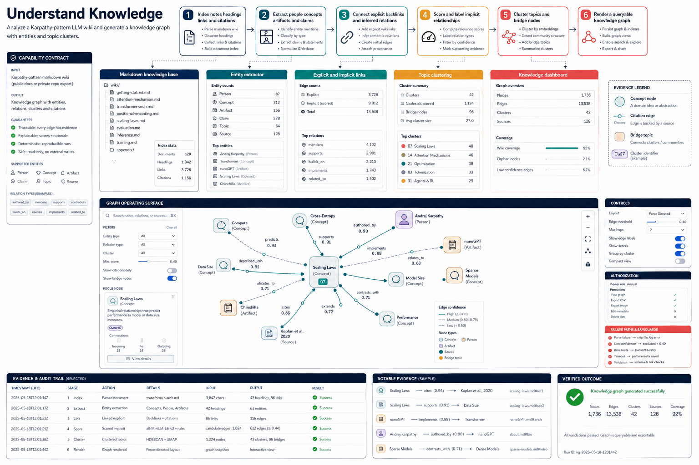

# How Understand Knowledge Works

Analyze a Karpathy-pattern LLM wiki and generate a knowledge graph with entities and topic clusters.

## Stages

### 1. Index notes headings links and citations

**Primary surface:** `Markdown knowledge base`

Record the input, operation, observable output, and any decision that changes scope. Stop here if the output is missing, contradictory, or insufficient for the next stage.
### 2. Extract people concepts artifacts and claims

**Primary surface:** `Entity extractor`

Record the input, operation, observable output, and any decision that changes scope. Stop here if the output is missing, contradictory, or insufficient for the next stage.
### 3. Connect explicit backlinks and inferred relations

**Primary surface:** `Explicit and implicit links`

Record the input, operation, observable output, and any decision that changes scope. Stop here if the output is missing, contradictory, or insufficient for the next stage.
### 4. Score and label implicit relationships

**Primary surface:** `Topic clustering`

Record the input, operation, observable output, and any decision that changes scope. Stop here if the output is missing, contradictory, or insufficient for the next stage.
### 5. Cluster topics and bridge nodes

**Primary surface:** `Knowledge dashboard`

Record the input, operation, observable output, and any decision that changes scope. Stop here if the output is missing, contradictory, or insufficient for the next stage.
### 6. Render a queryable knowledge graph

**Primary surface:** `Knowledge dashboard`

Record the input, operation, observable output, and any decision that changes scope. Stop here if the output is missing, contradictory, or insufficient for the next stage.

## Failure handling

- **Authorization failure:** do not probe credentials or broaden access; report the missing authority.
- **Target ambiguity:** stop before mutation and request the minimum identifying information.
- **Tool or service failure:** retain error evidence, retry only safe transient failures, and cap retries.
- **Verification failure:** classify the run as incomplete even when the preceding operation returned success.

## Completion evidence

The handoff should contain the original request, inspection state, preview or plan, exact execution result, direct verification, and a final receipt naming limitations and withheld actions.
