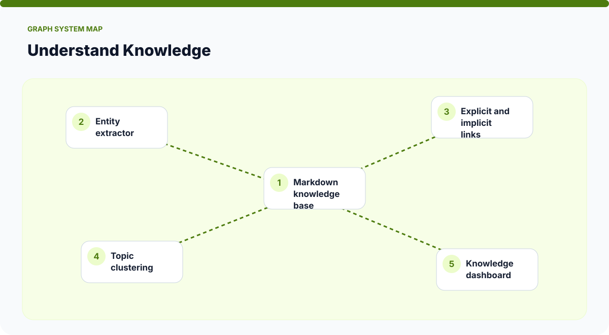
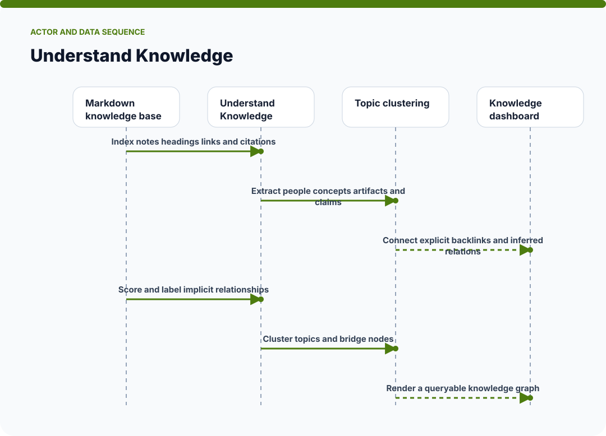
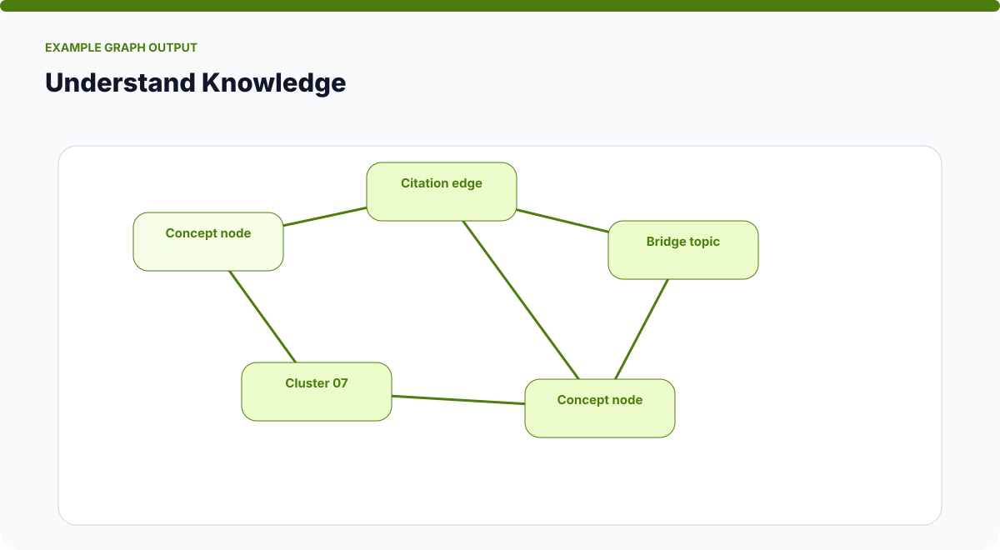
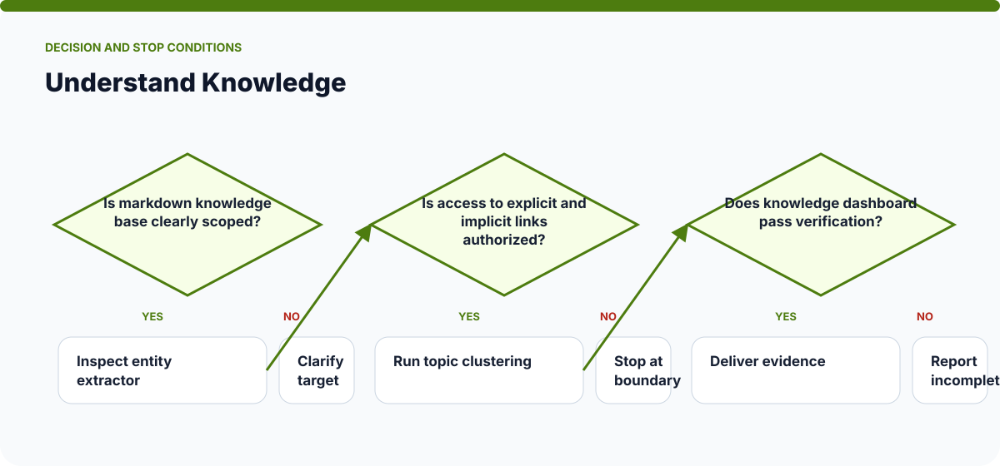

# How Understand Knowledge Works

The visuals on this page are static SVGs, so they render directly on GitHub on phones and desktop browsers. Each one is generated from a model specific to this skill.

## System architecture

### Components

- **1. Markdown knowledge base:** participates in index notes headings links and citations.
- **2. Entity extractor:** participates in extract people concepts artifacts and claims.
- **3. Explicit and implicit links:** participates in connect explicit backlinks and inferred relations.
- **4. Topic clustering:** participates in score and label implicit relationships.
- **5. Knowledge dashboard:** participates in cluster topics and bridge nodes.

## Actor and data sequence

### 1. Index notes headings links and citations

**Primary surface:** `Markdown knowledge base`

Record the concrete input, the operation performed, and the evidence produced at this stage. Continue only when the output is sufficient for the next stage; otherwise preserve the blocker and stop.
### 2. Extract people concepts artifacts and claims

**Primary surface:** `Entity extractor`

Record the concrete input, the operation performed, and the evidence produced at this stage. Continue only when the output is sufficient for the next stage; otherwise preserve the blocker and stop.
### 3. Connect explicit backlinks and inferred relations

**Primary surface:** `Explicit and implicit links`

Record the concrete input, the operation performed, and the evidence produced at this stage. Continue only when the output is sufficient for the next stage; otherwise preserve the blocker and stop.
### 4. Score and label implicit relationships

**Primary surface:** `Topic clustering`

Record the concrete input, the operation performed, and the evidence produced at this stage. Continue only when the output is sufficient for the next stage; otherwise preserve the blocker and stop.
### 5. Cluster topics and bridge nodes

**Primary surface:** `Knowledge dashboard`

Record the concrete input, the operation performed, and the evidence produced at this stage. Continue only when the output is sufficient for the next stage; otherwise preserve the blocker and stop.
### 6. Render a queryable knowledge graph

**Primary surface:** `Markdown knowledge base`

Record the concrete input, the operation performed, and the evidence produced at this stage. Continue only when the output is sufficient for the next stage; otherwise preserve the blocker and stop.

## Example output shape

The example is a visual contract: a real run may look different, but it should expose comparable state, provenance, and verification information. It is not presented as evidence of a live external action.

## Decision and stop conditions

The workflow stops when the target is ambiguous, the relevant surface is unavailable or unauthorized, or the final artifact cannot be checked. A logged-in session or successful tool call is not by itself proof that the requested outcome is complete.

## Verification checklist

- Confirm every component shown in the system map exists in the target environment.
- Trace the actor sequence using actual tool output or artifact state.
- Compare the result with the example-output information contract.
- Re-read or reopen the final artifact instead of trusting an attempt message.
- Report omitted stages, unsupported capabilities, and remaining human decisions.
